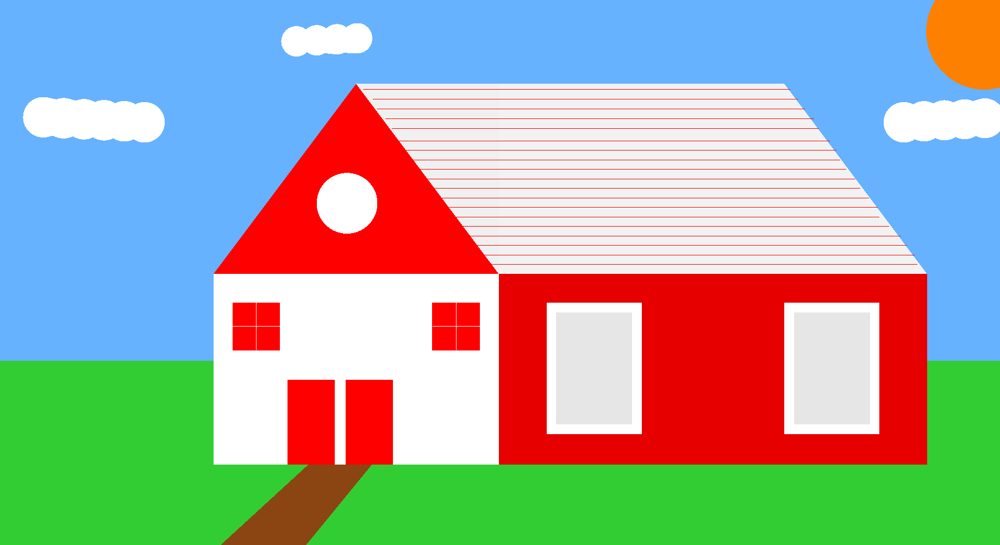

# 🖥️ Projetos-Computacao-Grafica

-  Repositório voltado para a matéria de Computação Gráfica, buscando perceber melhorias e aprendizado, com sucessivos projetos e atualizações.

# 🏡 Primeiro Projeto - Casa 2D

 -   Para iniciar a utilização de OpenGL, foi proposta a criação de uma casa de estrutura simples.
A casa deveria satisfazer os componentes principais do OpenGL (utilizar triângulos, quadriláteros
e círculos),possuir janelas, uma porta, chaminé e uma janela redonda frontal.Apesar de simples, o
projeto é de grande importância para uma maior familiaridade com as funcionalidades do OpenGL. 

